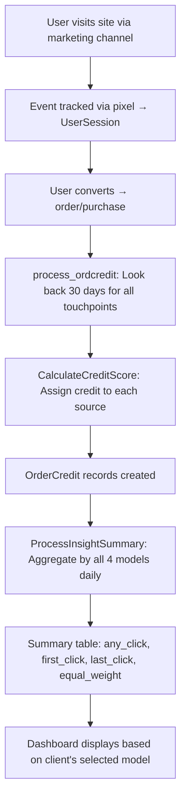

## Overview

Mission Control supports **five attribution models** that determine how conversion credit is distributed across marketing touchpoints. Each model answers a different question about your marketing effectiveness.

## How Attribution Works

### The Pipeline



### Step 1: Event Tracking

When a user visits your site, the tracking pixel captures the session in the `usersession` table with:
- **media_source** -- the traffic source (Google Ads, Facebook Ads, Email, Direct, etc.)
- **mkt_campaign**, **mkt_content**, **mkt_term** -- UTM parameters
- **event_type** -- page_view, link_click, transaction

### Step 2: Order Credit Calculation

When a conversion occurs, the `process_ordcredit` command:

1. Retrieves the client's **attribution lookback window** (default: 30 days)
2. Finds all `page_view` events within that window before the conversion
3. Calculates a **credit score** for each touchpoint
4. Creates `OrderCredit` records linking each source to the order

### Step 3: Credit Score Calculation

The `CalculateCreditScore` algorithm:

| Scenario | Credit Assignment |
|---|---|
| Single source, single event | Score = `1` (full credit) |
| Single source, multiple events | Score = `1/count` per event |
| Multiple sources | Score = `1/source_count` per source |

**Excluded sources** (Direct, Afterpay, Clearpay, Klarna) receive a credit score of `0` -- they don't count toward the division.

### Step 4: Daily Summary Aggregation

`ProcessInsightSummary` runs daily and calculates **all four models** simultaneously, storing results in the `interaction_insight_summary` table:

| Column | Model |
|---|---|
| `any_click_order` / `any_click_revenue` | Any Click |
| `first_click_order` / `first_click_revenue` | First Click |
| `last_click_order` / `last_click_revenue` | Last Click |
| `linear_click_order` / `linear_click_revenue` | Equal Weight |

## Attribution Models

### Any Click (All Touch)

Every source that touched the customer receives **full credit** for the order.

**SQL logic:** Groups by `tr_orderid, source_credit` → takes `MAX(id)` per source → sums `tr_total` for each source.

**Example:** A $100 order with 3 touchpoints (Google, Email, Facebook) → each source shows $100 revenue. Total displayed = $300.

<Note>
Any Click **intentionally overcounts** revenue. The total across sources will exceed actual revenue because each order is counted once per source that touched it.
</Note>

### First Click

Only the **first** source in the customer's journey receives credit.

**SQL logic:** Takes `MIN(id)` per order → full credit to earliest touchpoint.

**Example:** Google Ad (first) → Email → Facebook → Purchase. Google Ads gets 100% credit.

### Last Click

Only the **last** source before conversion receives credit.

**SQL logic:** Takes `MAX(id)` per order → full credit to final touchpoint.

**Example:** Google Ad → Email → Facebook (last) → Purchase. Facebook Ads gets 100% credit.

<Info>
Last Click totals match Shopify revenue because each order is counted exactly once.
</Info>

### Equal Weight (Linear)

Credit is split equally among all sources using the pre-calculated `credit_score`.

**SQL logic:** `SUM(credit_score)` for orders, `SUM(tr_total * credit_score)` for revenue.

**Example:** $100 order with 3 sources → each gets $33.33 credit. Total = $100.

### View Through Attribution

Assigns credit to paid **impressions** (not clicks) that may have influenced organic conversions.

**Calculation:**
1. Get the view-to-click ratio from Facebook Ads data
2. Calculate view-through visits = `fb_ads_visits * attribution_ratio`
3. View-through ratio = `(viewthrough_visits / organic_visits) * 100`
4. Attributed conversions = `organic_orders * viewthrough_ratio`

Configurable via `viewth_attfraction` (default: 80%).

## Choosing a Model

| Model | Best For | Revenue Matches Shopify? |
|---|---|---|
| **Any Click** | Understanding which channels contribute to sales | No (overcounts) |
| **First Click** | Measuring customer acquisition channels | Yes |
| **Last Click** | ROI/ROAS calculations, Shopify comparisons | Yes |
| **Equal Weight** | Balanced view across the full funnel | Yes |
| **View Through** | Measuring impact of display/impression campaigns | N/A |

## Client Configuration

Each client's default attribution model is set in their account configuration:

| Setting | Field | Options |
|---|---|---|
| Attribution Model | `mediasource_click_priority` | Any Click, First Click, Last Click, Equal Weight, View Through Attribution |
| Lookback Window | `attr_lookup` | Number of days (default: 30) |
| View-Through Fraction | `viewth_attfraction` | Percentage (default: 80) |

Configure via **Settings > System Configuration** in the Mission Control dashboard, or through the API:

```
PUT /api/user/systemconf
```

The selected model determines which columns from the `interaction_insight_summary` table are displayed across all reporting views (MOAT, Campaign Performance, Ad Performance, Executive Summary).

## Attribution Window

The attribution window (lookback period) controls how far back the system looks for marketing touchpoints when assigning credit to a conversion.

- **Default:** 30 days
- **Applied during:** `process_ordcredit` (Order Credit calculation)
- **Query:** All `page_view` events between `(conversion_date - lookback_days)` and `conversion_date`

Only page view events count as touchpoints. Events outside the attribution window are not considered.
