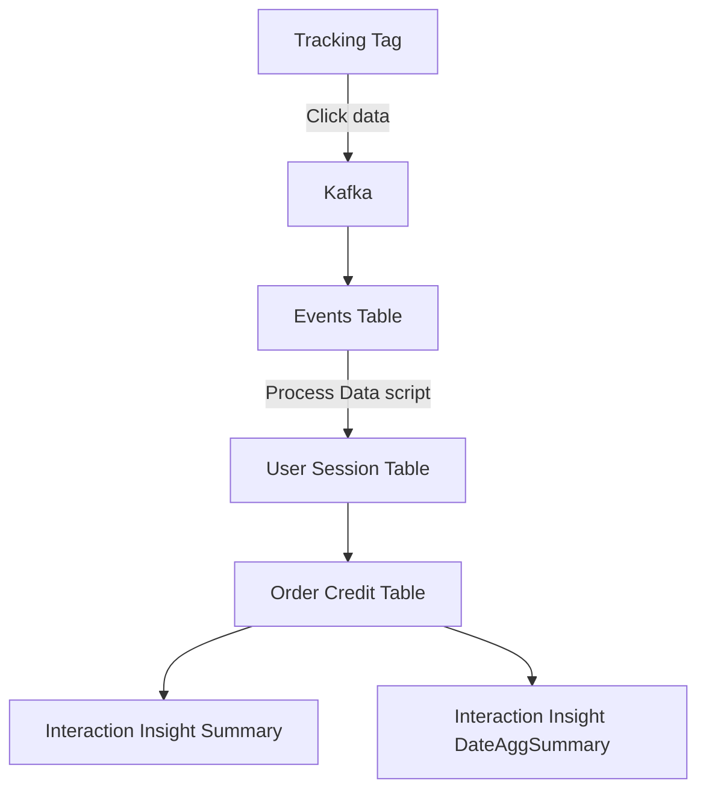
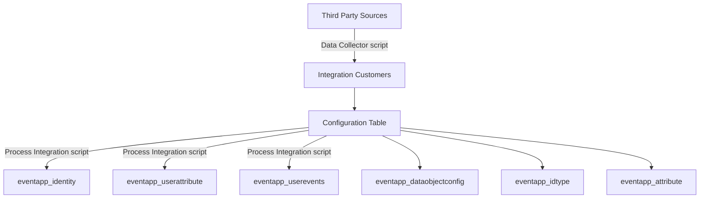

## Overview

The Mission Control database is organized into three core models that handle the full data pipeline from event ingestion through customer identity resolution and user management.

## Event Model

Data from every connected client is processed through **Kafka** and stored in the Events table. The tracking tag is responsible for fetching client click data and sending it to Kafka consumers.

### Data Flow

### Tables

<AccordionGroup>
  <Accordion title="Events">
    Raw event data ingested through Kafka. This data is further processed by the "Process Data" script for evaluating, analyzing, and scrubbing.

    | Column | Type | Constraints |
    |---|---|---|
    | `event_id` (PK) | int | NOT NULL |
    | `app_id` | int | NOT NULL |
    | `platform` | char | |
    | `event` | char | |
    | `event_id` | char | |
  </Accordion>

  <Accordion title="User Session">
    Contains processed user details including orders, visits, and transaction details.

    | Column | Type | Constraints |
    |---|---|---|
    | `parent_id` (PK) | int | NOT NULL |
    | `client_id` | int | NOT NULL |
    | `session_id` | int | NOT NULL |
    | `event_type` | char | |
    | `event_date` | timestamp | |
    | `user_journey` | | |
    | `user_ipaddress` | char | |
  </Accordion>

  <Accordion title="Order Credit">
    Stores credit given to each source that a user has come through. Tracks orders and visits by customer.

    | Column | Type | Constraints |
    |---|---|---|
    | `id` (PK) | int | NOT NULL |
    | `session_id` (FK) | int | NOT NULL |
    | `source_credit` | char | |
    | `event_date` | timestamp | |
    | `client_id` | int | NOT NULL |
    | `parent_id` | char | NOT NULL |
  </Accordion>

  <Accordion title="Interaction Insight Summary">
    Records order information by media source for the Customer Interaction platform.

    | Column | Type | Constraints |
    |---|---|---|
    | `id` (PK) | int | NOT NULL |
    | `client_id` | int | NOT NULL |
    | `event_date` | date | NOT NULL |
    | `media_source` | char | |
  </Accordion>

  <Accordion title="Interaction Insight DateAggSummary">
    Tracks the number of times users visit a specific website, aggregated by date.

    | Column | Type | Constraints |
    |---|---|---|
    | `id` (PK) | int | NOT NULL |
    | `client_id` | int | NOT NULL |
    | `event_date` | date | NOT NULL |
    | `media_source` | char | |
    | `session_count` | numeric | |
  </Accordion>
</AccordionGroup>

## Customer Model

This model retains data from third-party sources like Shopify and HubSpot. The **Data Collector** script processes data from these sources and stores it in the Integration Customer table.

### Data Flow

### Tables

<AccordionGroup>
  <Accordion title="Integration Customers">
    Raw customer data from third-party integrations.

    | Column | Type | Constraints |
    |---|---|---|
    | `id` (PK) | int | NOT NULL |
    | `client_id` | int | NOT NULL |
    | `source_type` | char | |
    | `created_at` | timestamp | |
  </Accordion>

  <Accordion title="Configuration Table">
    Manages the mapping and routing of customer data from the Integration Customers table to the eventapp tables. Divided into three sub-tables:

    **eventapp_dataobjectconfig**

    | Column | Type |
    |---|---|
    | `id_type` | int |
    | `source` | char |
    | `data_feed` | char |
    | `page_data_type` | char |
    | `unique_name` | char |
    | `mask_display` | bool |
    | `client_id` | int |

    **eventapp_idtype**

    | Column | Type |
    |---|---|
    | `id` | int |
    | `name` | char |
    | `customer` | bool |
    | `belonging_level` | int |
    | `recognized` | bool |
    | `client_id` | int |

    **eventapp_attribute**

    | Column | Type |
    |---|---|
    | `id_type` | int |
    | `name` | char |
    | `display_order` | int |
    | `label` | char |
    | `group_display_order` | int |
    | `client_id` | int |
  </Accordion>

  <Accordion title="eventapp_identity">
    Stores customer credentials (email, customer ID) resolved from the Integration Customers table.

    | Column | Type | Constraints |
    |---|---|---|
    | `id` (PK) | int | NOT NULL |
    | `parent_id` (FK) | char | NOT NULL |
    | `child_id` | char | NOT NULL |
    | `source` | char | |
    | `client_id` | int | NOT NULL |
  </Accordion>

  <Accordion title="eventapp_userattribute">
    Retains additional customer details such as name, address, and contact information.

    | Column | Type | Constraints |
    |---|---|---|
    | `id` (PK) | int | NOT NULL |
    | `alt_id` | int | |
    | `client_id` | char | |
    | `sort` | bool | |
  </Accordion>

  <Accordion title="eventapp_userevents">
    Records customer events (currently stores Gorgias data).

    | Column | Type | Constraints |
    |---|---|---|
    | `id` (PK) | int | NOT NULL |
    | `parent_id` (FK) | char | NOT NULL |
    | `event_id` | char | |
    | `source` | char | |
    | `client_id` | char | NOT NULL |
    | `event_details` | json | |
  </Accordion>
</AccordionGroup>

## Users Model

Handles client onboarding and authentication. When a new client registers through the client registration form, their details are stored in the `useraccount_client` table with a corresponding `client_id`. Login credentials (email and password) are stored in the `users` table under the same `client_id`.

### Tables

<AccordionGroup>
  <Accordion title="useraccount_client">
    Client account details created during registration.

    | Column | Type |
    |---|---|
    | `company` | char |
    | `web_url` | char |
    | `icon` | char |
  </Accordion>

  <Accordion title="users">
    User authentication and profile data.

    | Column | Type | Constraints |
    |---|---|---|
    | `id` (PK) | int | NOT NULL |
    | `password` | int | |
    | `last_login` | int | |
    | `first_name` | char | |
    | `last_name` | char | |
    | `email` | char | |
    | `client_id` | int | |
  </Accordion>
</AccordionGroup>
