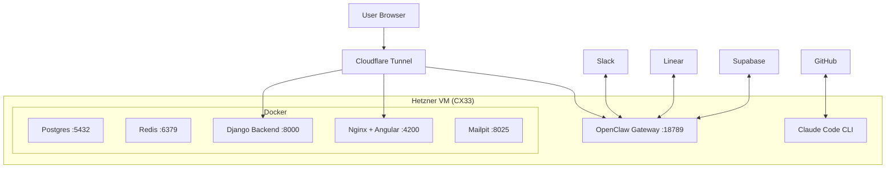

# Architecture

Each intern is a Hetzner Cloud VM (CX33 — 4 vCPU, 8GB RAM) running a full development stack, connected to the outside world via Cloudflare Tunnel.

## Infrastructure

## Services

### OpenClaw (Port 18789)

The AI gateway that connects Slack to Claude Code CLI. Runs as the `agent` user with systemd.

- **Auth**: Password + token (dual layer)
- **Channels**: Slack (socket mode)
- **Model**: Claude Haiku for orchestration, Claude CLI for coding
- **Tools profile**: Full (includes `gog` for Google Workspace)

### Cloudflare Tunnel

Named tunnel with persistent URLs. Three subdomains per instance:

| Subdomain | Routes to | Purpose |
|---|---|---|
| `<name>.lunarintern.com` | OpenClaw :18789 | Dashboard & agent control |
| `api-<name>.lunarintern.com` | Django :8000 | Backend API |
| `app-<name>.lunarintern.com` | Nginx :4200 | Angular frontend |

### Docker Stack

| Container | Image | Purpose |
|---|---|---|
| `postgres` | postgres:15 | Application database (seeded from KV dump) |
| `redis` | redis:7-alpine | Cache + session store |
| `backend` | python:3.11-slim | Django API server |
| `frontend-builder` | node:24-slim | Builds Angular (runs once, exits) |
| `frontend` | nginx:alpine | Serves compiled Angular app |
| `mailpit` | axllent/mailpit | Local email testing |

### Claude Code CLI

Runs as the `agent` user (non-root) with `--permission-mode bypassPermissions`. Uses your Claude Team subscription via OAuth — no API tokens consumed.

## Security

| Layer | Protection |
|---|---|
| **Password** | 32-byte random, unique per instance |
| **Token** | Separate gateway token for API access |
| **HTTPS** | Enforced by Cloudflare (no plaintext) |
| **Origins** | Locked to instance hostname only |
| **Proxy Trust** | Only Cloudflare IPs accepted |
| **Firewall** | Hetzner firewall attached at creation |
| **Auth** | `allowInsecureAuth: false` |

## Data Flow

### Secrets Management

Secrets are stored in **Cloudflare Workers KV** and pulled at boot time. Nothing is committed to git.

| Secret | Storage |
|---|---|
| LayerFive backend `.env` | Cloudflare KV (`LAYERFIVECORE_ENV`) |
| Database seed | Cloudflare KV (`DB_SEED_DUMP`) |
| API keys (Hetzner, CF, etc.) | Supabase Edge Function secrets |
| Per-instance secrets | Injected via cloud-init at boot |

### State Management

All agent state is stored in **Supabase**:

- `agents` — identity, status, capacity
- `tasks` — Linear tickets being worked on
- `pull_requests` — PRs created by agents
- `pr_comments` — review comment tracking
- `activity_log` — audit trail

## Snapshot

The base VM image (Hetzner snapshot) contains:

- Node.js 24, Python 3.11, Go, Docker
- OpenClaw, Claude CLI (pre-authenticated), cloudflared, gh, gogcli
- Pre-cloned repos: `layerfivecore`, `l5ui`, `docs`
- Pre-pulled Docker images
- 18 agent tools (Linear, Slack, GitHub, Supabase, rebuild)
- Workspace docs (AGENTS.md, TOOLS.md, IDENTITY.md)
- 4GB swap file

Cloud-init injects per-instance config on first boot.
